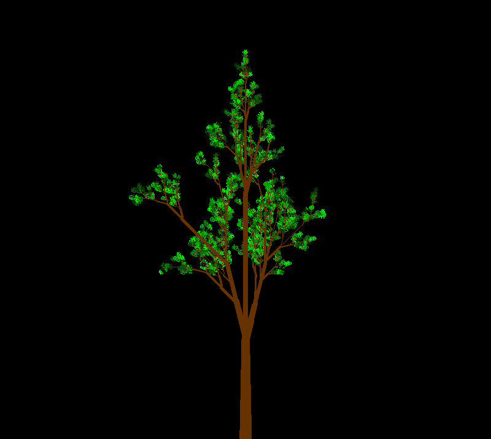
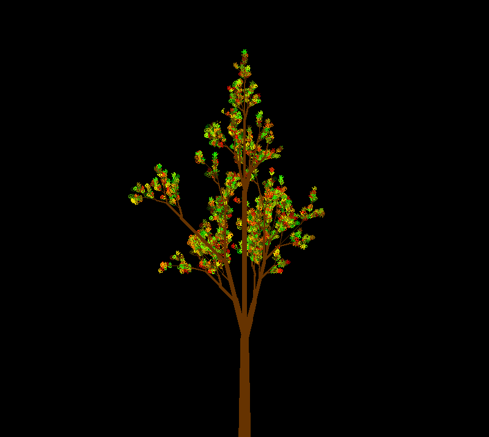
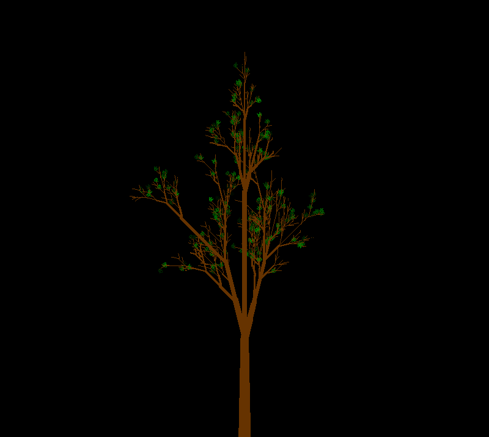

# Introduction

L-systems are used for modelling the growth of plants through recursion. This project is an implmentation of an L-system in C++11 to render a tree in OpenGL.

# What is an L-System?
L-systems, introduced and name after a biologist Lindenmayer, are parallel rewriting systems which use formal languages (generated by context-free or context-sensitive grammars). An L-system consists of the following:
1.  **Alphabet:** The set of symbols allowed in the language
2. **Production rules:** A set of rules which define how each symbol can be expanded to a larger string of symbols
3. **Axiom:** The initial string used for recursive generation

This may seem similar to fractals, which are a specific kind of l-system.

A simple bracketed l-system (which allows saving and restoring state) can generate very complex strings which can be interpreted as instructions in turtle-like graphics.

# Our L-System

The l-system we used is a **bracketed stochastic 0L-system**. What this means is that we have a *context-free grammar* as production rules. Stochastic means that there are multiple production rules for a single symbol in our alphabet and there is a finite probability of expanding using each of these.

* **Alphabet:** { F, X, [, ], -, + }
* **Production rules:**:  

    ```
    {
        X -(0.25)-> F-[[X]+X]+F[[X]+X]-X
        X -(0.25)-> F-[[X]+X]+F[-FX]+X
        X -(0.25)-> F[+X][-X]FX";
        X -(0.25)-> F[+X]F[-X]+X";

        F -> FF
    }
    ```
* **Axiom:** "X"

## Turtle interpretation of symbols
1. `F`  =  Move forward, drawing a line
2. `+`  =  Rotate head left by <angle>
3. `-`  =  Rotate head right by <angle>
4. `[`  =  Save state of turtle (State: x, y, rotation, thickness)
5. `]`  =  Restore state of turtle

## Other implementation details

For drawing leaves, the terminal symbol `X` has been used along with the next symbol of the string. If the symbol `X` is encountered, with the following symbol as `[`, then a leaf is drawn.


**Branch width contraction** occurs at every branching point in the tree.

**Trunk tapering** is performed until the first branch is encountered, after which branch contraction is performed.

Color of leaves is taken from a uniform random distribution, based on a variable used to denote season.

* #### Summer/spring


* #### Autumn


* #### Winter


Every execution of the program leads to a slightly different tree structure due to the stochastic l-system, random angle of branching, and random leaf colors.

# Requirements

* GPU with OpenGL 3.3+ support
* Ubuntu

# Dependencies

* GLFW - required for creating an OpenGL context. Instructions for installing can be found [here](http://www.glfw.org/download.html).
* CMake - install using ```sudo apt install cmake```

# Project Structure

This project consists of the following files:

* ```graphics.h``` - class containing primitive (line and circle) drawing methods
* ```turtle.h``` - class implementing turtle like graphics for interpreting L-system generated code
* ```primitives.cpp``` - demonstrates the primitive drawing method by rendering a bicycle wheel
* ```tree.cpp``` - procedurally generates a tree changing colours with the seasons using an L-system

# Buidling

Clone or unzip the project to your favorite folder. Then run:

```
mkdir build
cd build
cmake ..
make
./tree
```

To run the primitive drawing demonstration program, make sure your active directory is set to ```build/``` and run ```./primitives```.

# Contributors

* Arnav Dhamija
* Pranav Asthana
